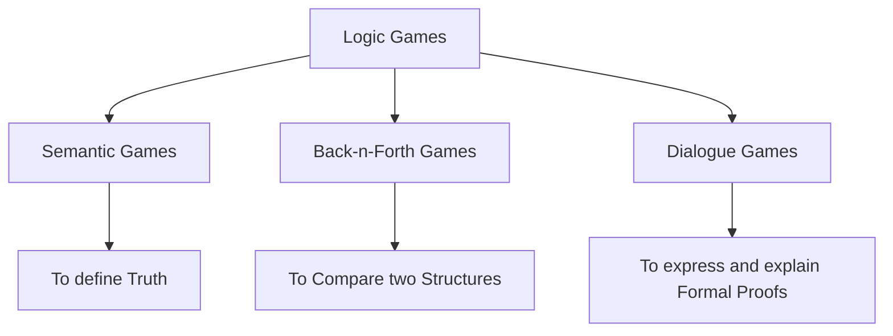

09-01-2023  15:01

*Status* : #wonder #tolearn #wonder 

*Tags* : [[logic]] [[games]]

# Logic and Games

---

## Types




----

## Highlights from History

1. Aristotle's dialectics - debate as a kind of a game.
2. [[galestewart]]  - Connections between Set Theory and Games in fact point set topology. ![[Logic and Games#Gale-Stewart Theorem (1953)]]
3. Henkin - useful way of using games to give semantics for infinitary languages
4. Argumentation Theory - Games form a tool for analysing the structure of debates.

---

## Games as techniques in the combinatorial analysis for Logic

1. Usually of the type of `2-player` games, concerned with `winning and losing` and they can theoretically do an `infinite duration play`.
2. Domain of the game $\Omega$ 
3. Play : $p \in \Omega^\omega$, an infinite sequence of elements of $\Omega$
4. Position : $pos \in \Omega^{<\omega}$, that is, it's a finite sequence of elements of $\Omega$, highlights the place till which the game has elapsed.
5. Turn : $Position \to Player$, that is for each finite sequence of $\Omega$, ie a position from the set of all positions, $Position$, this function maps who gets the control of the _next move_ from the set of $Players$. 
6. Winning regions : $W_{p \in Player} \subseteq Position$
7. Logical Game : $\langle \Omega,Player,Turn, W_p \rangle$
8. Game is ==Total== if $Play = \cup_{p\in Player} W_p$    This is not equal to the property of Determinacy.
9. Strategy - instructions for players to choose an element at a position for the particular player. $S_p : \{a\in Position : Turn(a)=p\} \to \Omega$ , it is called a ==winning strategy== when, no matter the choice of the other players, $p$ just by obeying the instructions encoded in $S_p$ is able to reach a position in $W_p$ thereby winning.
10. Game is said to be ==Determined== if one of the players has a winning strategy.

 ```ad-note
title: Theorem : [[Gale-n-Stewart]](1953)

Only Assumptiom : Ax of Choice.

(1)There are examples of games that are _not determined!_

(2)Every well-founded game is determined.

A game $G$ is said to be _closed_ if there exists wins every play of $G$ in which she hasn’t already lost at any finite position. The theorem states that every closed game is determined.
```
 ```ad-note
title: Corollary 

Every game of finite length is determined.
```
11. Proof Idea : --have to fill in--

---

## Semantic Games

Kripke model like the Canonical Modal Logic model [[Canonical Model for Modal Logic#Canonical Model for Modal Logic]] .

$\langle W,R,P_i\rangle$ : 
1. $W$ - set of worlds
2. $R \subseteq W \times W$ - Edges between the worlds
3. $P_i \subseteq W$ 


- Memoryless Winning Strategies are present in these games
- Influences from economics have led to a number of logicians use logic for analysing decision making under conditions of partial ignorance - [[epistemic logic]]


---

## Back-n-Forth Games
 [[back and forth]]
1. Tarski - 1930 - Notion of two structures $A$, $B$ are _elementarily equivalent_ - ie the same first order sentences are true in A as they are true in B. $\{\phi \in FO ~|~ A \models \phi \}= \{ \phi \in FO ~|~ B \models \phi\}$ [[Finite and Algorithmic Model Theory Lecture I#Finite Elementary Equivalence]]
2. Tarski wanted a theory of elementarity to be as deep as the notions of isomorphism, Roland Fraisse was the first to find a usable necessary and sufficient condition. Taimanov and Ehrenfeucht formulated the condition in terms of games. [[Finite and Algorithmic Model Theory Lecture I#What do these above equivalence definitions get you?]]
3. The `theory behind back-n-forth games` uses very few assumptions about the `logic` in question! Hence, it is one of the few model-theoretic techniques that apply both to `finite` and `infinite structures`.
4. People use them to measure the _expressive_ strength of _formal languages_ .
5. After $n$- steps of the game we would have $$(a_0,\ldots,a_{n-1};b_0\ldots,b_{n-1})$$
6. This _position_ is a win for **spoiler** iff some atomic formula, ie, `R(a,b,c) or f(a,b)=c or a=b` , is satisfied by $(a_0,\ldots,a_{n-1})$ in $A$ but not by $(b_0,\ldots,b_{n-1})$ in $B$, or vice versa.
7. For each natural number $n$, we have $EF_n(A,B)$ : in this game _duplicator_ wins if no initial part of it, that is, for no $m<n$ was there a $EF_m(A,B)$ where the _Spoiler_ won.
8. ==All these games are determined by the Gale-Stewart Theorem.==
9. The two structures $A,B$ are said to be `Back-n-Forth` equivalent if the _duplicator_ has a winning strategy for $EF(A,B)$. 
10.  The two structures $A,B$ are said to be `m`-equivalent if the _duplicator_ has a winning strategy for $EF_m(A,B)$. 
11.  If $A,B$ are $m$-equivalent for all $m\in \mathbb{N}$, then,  $A,B$ are elementarily equivalent.
12. Back-n-Forth Equivalence turns out to be the same as elementary equivalence of an ==infinitary logic== which is more expressive than ==FO==.


### Pebble Games

1. There are many adjustments to the game that can give rise to other kinds of equivalence.
2. Barwise, Immerman and Poizat - independently described a game in which the two players have exacrly $p$ numbered pebbles each.
3. The significance of the pebbles was to serve as labels for the choices made by the players.
4. As the game proceeds the players will run out of pebbles and they will have to re-use pebbles that were already used.
5. The winning condition for _spoiler_ is the same as above with the  added constraint that only those elements whose positions are  pebbled matter.
6. The existence of a winning strategy for _duplicator_ in this pebbled game means that the two structures agree on sentences which use at most $p$ variables, allowing these variables to occur any number of times.

### Bisimulation

1.  Johan van Bentham's PhD thesis - 1976- on the semantics of modal logic contained this idea.
2. For a modal kripke world, $Z$ be a binary relation that relates between the two world of $A$ and $B$. 
3. $Z$ is a ==bisimulation== between $A,B$ if _duplicator_ can use $Z$ as a "Non deterministic" winning strategy in the back-n-forth game between $A$ and $B$. 
4. The first pair of moves is to choose the _starting state_. `perhaps the non determinism lies here`
5. The notion of bisimulation expresses that the two systems interact with their environment in the same way.


---

## Model Theoretic Games

Some Conceptually interesting games which are mathematician's tools.

### Forcing Games or Banach-Mazur Games

1. Also known as `Banach-Mazur Games` to `descriptive set theorists`.
2. It is used to build _infinite structures_ with _controlled properties_.
3.  Model-Existence Game, $\exists$ claims that a fixed sentence $\phi$ has a model, and $\forall$ claims that a contradiction can be derived from $\phi$.
4. In the beginning an infinite set $C$ of new constants are fixed $a_0,a_1,a_2,\ldots$ 
5. $\exists$ defends a disjunction by choosing one disjunct, and an existential statement by choosing a constant from $C$ as a witness.
6. $\forall$ can challenge a conjunction by choosing either conjunct and a universal statement by choosing an arbitrary witness from $C$.
7. $\exists$ wins if no contradicting atomic sentences are played.$\exists$ has a winning strategy - a consistency property is one way of describing a winning strategy- iff $\phi$ has a model.
8. If $\forall$ wins, the tree of all plays against his winning strategy is related to a `Gentzen style proof` of the negation of $\phi$. 
9. This method of analysing sentences is closely related to Beth's method of semantic tableux and the Dialogical Game.
10. The conjunction of a countably infinite set of enforceable properties is again enforceable for the model construction.
11. Various Lowenheim-Skolem Theorems of model theory can be proved using variants of the Forcing Game.
12. In these variants we construct a submodel of a given model.
13. `Forcing` nomenclature  comes from the related ideas of `Paul Cohen` , to construct models of set theory, in the early 1960s.
14. `Robinson` adapted it to make a general method for building countable structures.
15. `Martin Zeigler` introduced the game setting.
16. `Robin Hirsch` and `Ian Hodkinson` used related games to settle some questions about `Relational Algebras`.

### Cut-n-Choose Games

1. `Fair-Division` cake cutting game.
2. Iterate this, I make the other person cut the piece of cake I choose into two; then I choose one of those, and I again make the other person cut that piece.
3. These games are important in the `Theory of Definitions`.
4. Let's suppose we have a collection $A$ of objects, and a family $S$ of properties.
5. Each property cuts $A$ into a set that satisfies those properties and another that doesn't.
6.  Let $\exists$ cut, starting from the whole set $A$ and using a property is $S$.
7.  Let $\forall$ choose one of the pieces to give back to $\exists$ to cut.
8. $\exists$ looses as soon as $\forall$ chooses an empty set.
9. We say $(A,S)$ has rank at most $m$ if $\forall$ has a strategy which ensures that $\exists$ will loose before the $m$-th move.
10. This particular `rank` gives valuable information about the family of subsets of $A$ definable by properties in $S$.
11. Variation of this, where a piece can be cut into infinitely many smaller pieces, are fundamental in the branch of model theory called ==stability theory==.
12. Broadly, A theory is _good_ in terms of [[stability theory]] if whenever we take a model $A$ if the theory and $S$ the set of FO formulas in one-free varaible with parameters from $A$, the structure $(A,S)$ has `small rank`.
13. Another different variation is to ask that at each step, $\exists$ divides into two each of the two pieces from the set $S$ , forming an infinite binary division sort of, and $\exists$ looses as soon as any of the cut fragment is _empty_. ($\forall$ is redundant in this)
14. In this above variation, the rank of $(A,S)$ is called [[VC]] dimension. (Vapnik-Chervonenkis dimension)
15. VC dimension is an important notion in computational learning theory.


----


## Games of two successor functions

[[rabin's theorem]]

`Rabin's theorem`  (1969): There is an algorithm which will tell us for every monadic second-order sentence - $\phi$ in the language appropriate for the structure, $(\{0,1\}^{\mathbb{N}},S_0,S_1 )$ , whether or not $\phi$ is true or not. 

 In other words, the MSO theory of the infinite binary tree in the language with two successors is decidable.

`Consequence :` A simple consequence of Rabin’s theorem is that for every finite state transition system, the monadic second order theory of its computation tree is decidable.

`Use CASE :` Dov Gabbay, used this to prove the decidability of some modal logics.  

`Human talk regarding the theorem` : Rabin's proof using automata was notoriously difficult to follow! _Yuri Gurevich, Leo Harrington and Andrei Muchnik_ much later found simpler proofs in which the automaton is a player in a game.

`Connections` : It connects games with [[automata]] and give birth to _[[parity games]]_ !
[[parity games]] : are used for verifying properties of modal systems.


----

## Logical Games

A _logical game_ is a pair $\mathcal{G} =(G,\tau)$ where :
1. $G$ is a non empty set of sequences of length $\leq\omega$ , which is closed under initial segments and limits;
2. $\tau : G \to \{1,2\}$

- $G$ forms a tree branching upwards under the partial ordering $\vec{a}\preceq \vec{b}$ iff $\vec{a}$ is an initial segment of $\vec{b}$.
- Maximal elements of $G$ are **plays** of $G$.
- Remaining elements of $G$ are **positions.**
- A **play** $\vec{a}$ is a _win for_ $\tau(\vec{a})$. 
- A **position** $\vec{a}$ is a _turn of_ $\tau(\vec{a})$.
- **Strategy** for player $i$ is a function $$\Sigma^i :\{the ~set~of~turns~for~i\} \to G$$which has the property that for each turn $\vec{a}$ of $i$, $\Sigma^i(\vec{a})$ is immediately above( imagine the tree ) $\vec{a}$ in $G$. 
- A play $\vec{a}$ follows $\Sigma^i$ if for every turn $\vec{a}\vert_n$ of $i$, $\Sigma^i(\vec{a}\vert_n)\preceq \vec{a}$. 
- The strategy $\Sigma^i$ is **[[winning]]** if every play that follows $\Sigma^i$ is winning for player $i$.
- The game is **[[determined]]** if there exists a winning strategy for one of the players.

We can topologise the set of plays by taking them as basic open sets of the form :
$$\{ \vec{a} \in plays ~\mid~\vec{b}\preceq \vec{a} \} $$

---

## Gale-Stewart Theorem (1953)
[[galestewart]]
$\mathcal{G}$ is determined if for some player $i$ the set of wins for $i$ is open.

- Interesting thing is the link with [[topology]] and discrete [[games]] structures.

---
## Logical Games properties

1. Determined Logical games are zero-sum.
2. 


---
### References

1. [Stanford entry for this](https://plato.stanford.edu/entries/logic-games/)
2. [Kolodziejczyk,michalewski]How unprovable is Rabin’s decidability theorem.pdf
3. [hodges]Four paradigms for Logical Games.pdf

citing the Stanford Encyclopedia : 

@InCollection{sep-logic-games,
	author       =	{Hodges, Wilfrid and Väänänen, Jouko},
	title        =	{{Logic and Games}},
	booktitle    =	{The {Stanford} Encyclopedia of Philosophy},
	editor       =	{Edward N. Zalta},
	howpublished =	{\url{https://plato.stanford.edu/archives/fall2019/entries/logic-games/}},
	year         =	{2019},
	edition      =	{{F}all 2019},
	publisher    =	{Metaphysics Research Lab, Stanford University}
}